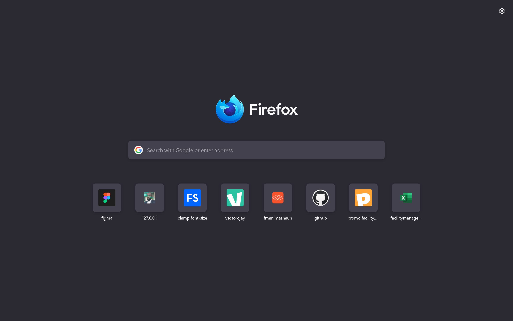
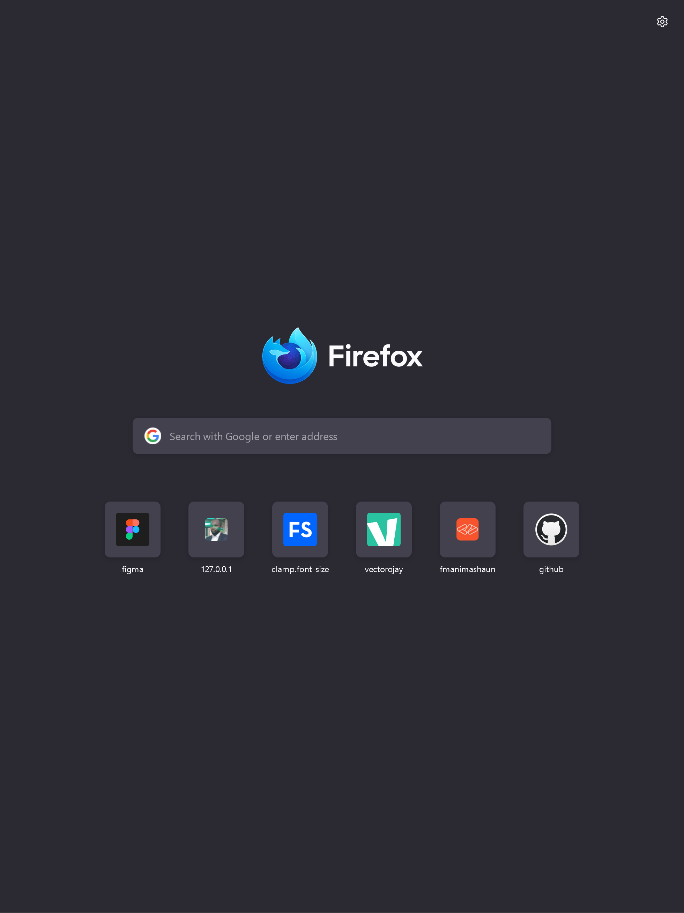
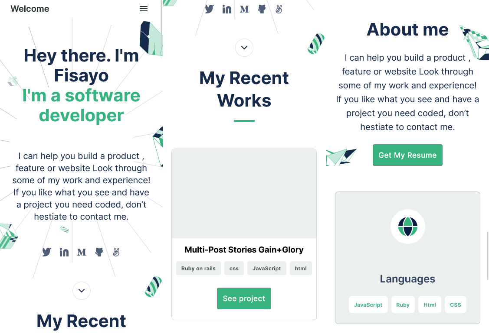

# My Personal Portfolio

## Overview

The project is focus on create a professional portfolio site to showcase my professional skills and experience while highlighting some of my real-life projects and other professional contributions to give an insight into my professional capacity and uniqueness. The Live site can be view from [my personal site](https://fmanimashaun.com/).

## Project Tasks List (Working-in-progress)

- [x] Setting up the initial project structure
- [x] mobile version skeleton
- [ ] Contact form
- [ ] Desktop version
- [ ] Application deploy
- [ ] Evaluate accessibility
- [ ] Mobile menu
- [ ] Details modal
- [ ] Validate contact form
- [ ] Preserve data in the browser
- [ ] Finalising the project page

> [Live Demo Link](https://fmanimashaun.com/)

## Screenshots

<h3 align="center">Desktop View</h3>

  

<h3 align="center">Tablet View</h3>

  

<h3 align="center">Mobile View</h3>

  

## Built With

- [HTML](https://developer.mozilla.org/en-US/docs/Web/HTML)
- [CSS](https://developer.mozilla.org/en-US/docs/Web/CSS)
- [JavaScript](https://developer.mozilla.org/en-US/docs/Web/JavaScript)
- [Algorithm Layout](https://every-layout.dev/)

## Authors

👤 **Engr. Animashaun Fisayo**

- [GitHub](https://github.com/fmanimashaun)
- [Twitter](https://twitter.com/fmanimashaun)
- [LinkedIn](https://www.linkedin.com/in/fmanimashaun/)
- [Website](https://fmanimashaun.com)

## 🤝 Contributing

Contributions, issues, and feature requests are welcome!

Feel free to check the [issues page](../../issues/).

## Show your support

Give a ⭐️ if you like this project!

## Acknowledgments

- Hat tip to anyone whose code was used
- [Figma Design Inspiration](https://www.figma.com/file/ZcNGugATyXmbMaYOdPHOZt/Microverse-Student-Project-1-(Copy)?node-id=23%3A9)

## 📝 License

This project is [MIT](./LICENSE) licensed.
